Задание 3. а) Реализовать алгоритм восстановления дерева по его двоичному коду. б) написать функцию экспорта графа в формат DOT. Приложить пример файла-графа и его визуализации через какой-нибудь Graphviz.  Бонусные баллы получит тот, кто вместо Graphviz реализует вручную свою визуализацию.

task3.py

Файл с деревом в дот формате сохраняется в файл tree.dot

Файл с ручной визуализацией дерева сохраняется в tree_manual.png

Graphviz брал отсюда https://dreampuf.github.io/GraphvizOnline/, сохранены в graphvizN.png

Входные данные для проверки ошибок:

Ошибка 1. В коде есть символ, отличный от 0 и 1:

code = "0102"

ValueError: В коде не только 0 и 1

Ошибка 2. Выход выше корня:

code = "1"

ValueError: Выход выше корня

Ошибка 3. Обход не вернулся в корень:

code = "0"

ValueError: Обход не вернулся в корень

Правильные входные данные:

Пример 1. Маленькое дерево из 3 вершин:

code = "0011"

Вершин: 3

Ребра: [(0, 1), (1, 2)]

Файл tree1.dot:
graph Tree {
    0;
    1;
    2;
    0 -- 1;
    1 -- 2;
}

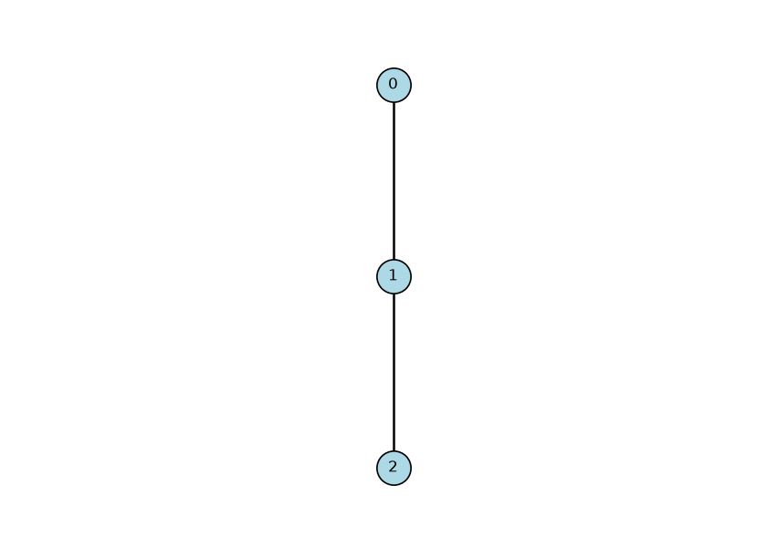

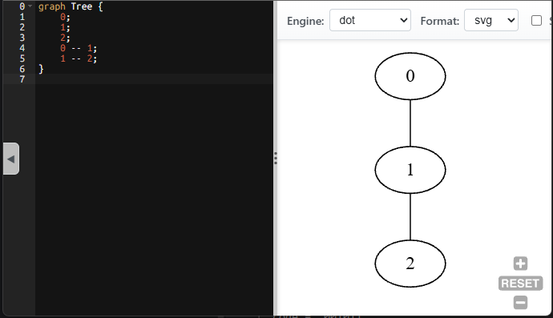

Пример 2. Дерево из 4 вершин:

code = "001011"

Вершин: 4

Ребра: [(0, 1), (1, 2), (1, 3)]

Файл tree2.dot:

graph Tree {
    0;
    1;
    2;
    3;
    0 -- 1;
    1 -- 2;
    1 -- 3;
}

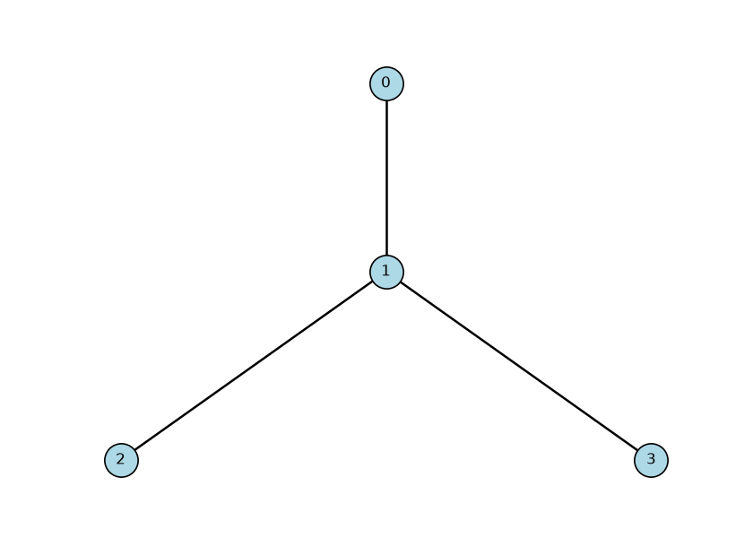

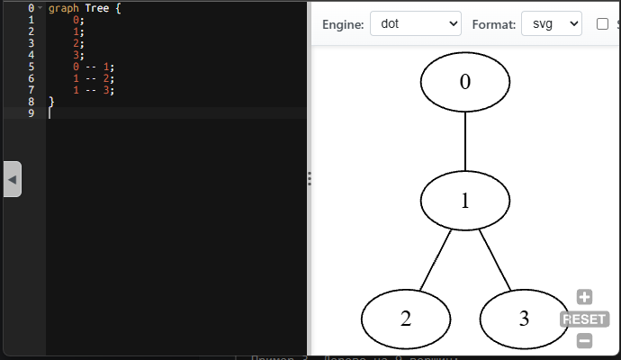

Пример 3. Дерево на 9 вершин:

code = "0100101011001011" 

Вершин: 9

Ребра: [(0, 1), (0, 2), (2, 3), (2, 4), (2, 5), (0, 6), (6, 7), (6, 8)]

graph Tree {
    0;
    1;
    2;
    3;
    4;
    5;
    6;
    7;
    8;
    0 -- 1;
    0 -- 2;
    2 -- 3;
    2 -- 4;
    2 -- 5;
    0 -- 6;
    6 -- 7;
    6 -- 8;
}

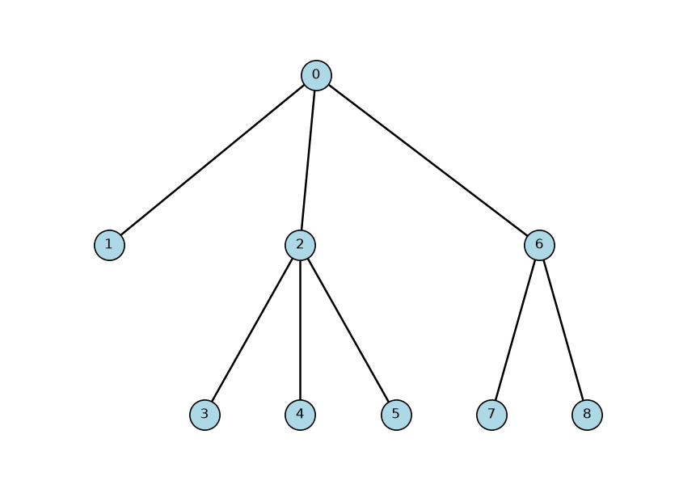

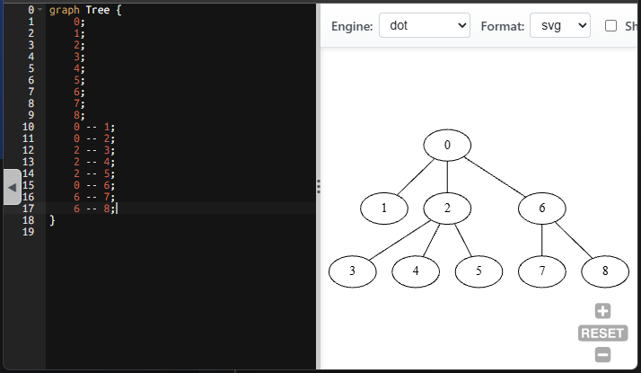

 
Задание 4. Реализовать венгерский алгоритм нахождения максимального (или минимального по весу) полного паросочетания на графе. а) граф двудольный, в нём найти оптимальный вес паросочетания; б) граф произвольный, здесь визуализировать найденное паросочетание

task4.py

Файл с рисунком паросочетания сохраняется в matching.png

Входные данные для проверки ошибок:

Ошибка 1. Граф не двудольный:

n = 3

edges = [(0, 1, 1), (1, 2, 1), (2, 0, 1)]

Граф не двудольный, венгерский алгоритм не применим

Ошибка 2. Доли разные:

n = 5

edges = [(0, 3, 1), (1, 3, 1), (2, 3, 1), (2, 4, 1)]

Доли разные, полного паросочетания не будет

Ошибка 3. Полного паросочетания нет, хотя доли равны:

n = 6

edges = [(0, 3, 1), (1, 3, 1), (2, 4, 1), (2, 5, 1)]

Полного паросочетания нет

Правильные входные данные:

Пример 1. Матрица 3 на 3 для венгерского алгоритма:

w = [[4, 1, 3],

     [2, 0, 5],
     
     [3, 2, 2]]
     
а) минимум: 5 назначения: [(0, 1), (1, 0), (2, 2)]

   максимум: 11

 
Пример 2. Небольшой двудольный граф с полным паросочетанием:

n = 6

edges = [(0, 3, 2), (0, 4, 5), (1, 3, 4), (1, 5, 1), (2, 4, 3), (2, 5, 6)]

б) вес: 6 ребра: [(0, 3), (1, 5), (2, 4)]

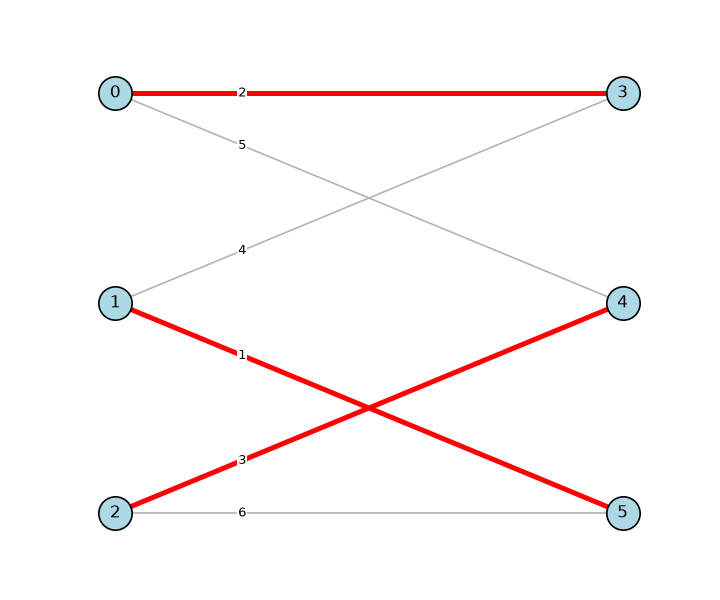

Пример 3. Большой двудольный граф с полным паросочетанием:
n = 8

edges = [(0, 4, 5), (0, 5, 9), (0, 6, 3), (1, 4, 2), (1, 5, 4), (1, 7, 6),
(2, 5, 8), (2, 6, 7), (2, 7, 1), (3, 4, 4), (3, 6, 6), (3, 7, 5)]

б) вес: 12 ребра: [(0, 6), (1, 5), (2, 7), (3, 4)]

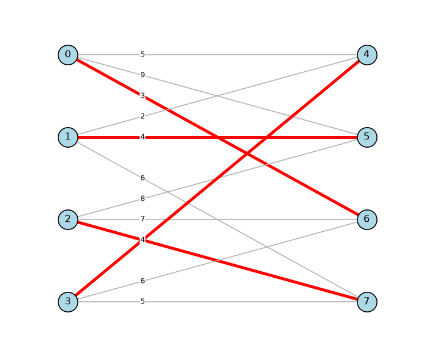

Задание 6. Для заданного графа проверить его планарность с помощью одного из алгоритмов комбинаторной укладки. Если он планарен, с помощью геометрической укладки нарисовать его.

task6.py

Файлы с выходными данными называются по шаблону planar_figure.png

Не планарные графы:

Пример 1. K5, не планарен:

k5 = [(i, j) for i in range(5) for j in range(i + 1, 5)]

K5 - не планарен

Пример 2. K3,3, не планарен:

k33 = [(i, j) for i in range(3) for j in range(3, 6)]

K3,3 - не планарен

Планарные графы:

Пример 1. Цикл C4:

c4 = [(0, 1), (1, 2), (2, 3), (3, 0)]

Цикл - планарен, граней: 2

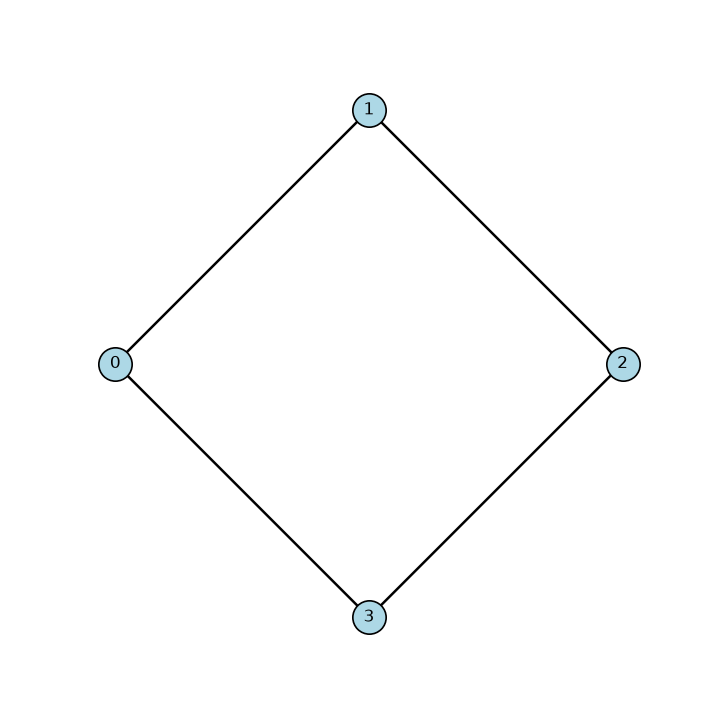

Пример 2. Куб:

cube = [(0, 1), (1, 2), (2, 3), (3, 0), (4, 5), (5, 6), (6, 7), (7, 4),
(0, 4), (1, 5), (2, 6), (3, 7)]

Куб - планарен, граней: 6

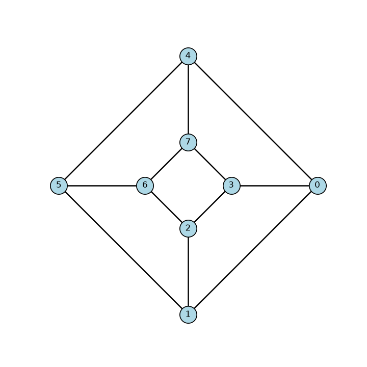

Пример 3. K4:

k4 = [(0, 1), (0, 2), (0, 3), (1, 2), (1, 3), (2, 3)]

Тетраэдр - планарен, граней: 4

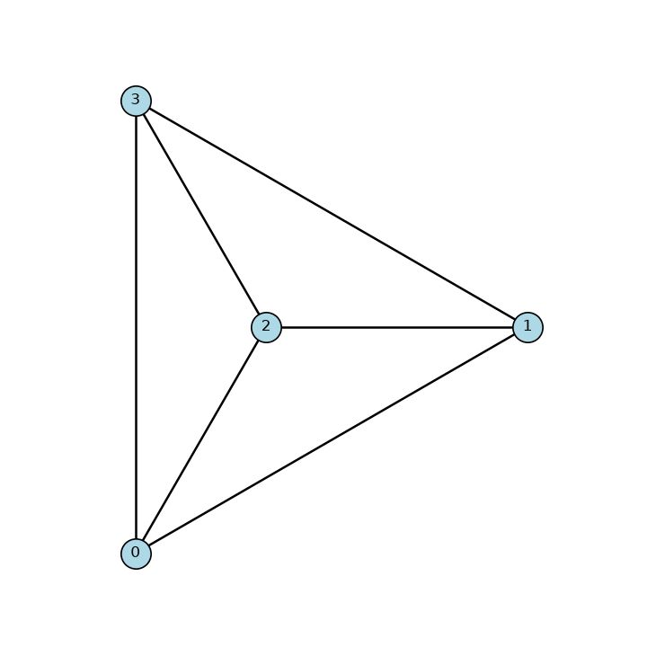

Пример 4. Граф без циклов, дерево из двух рёбер:

tree = [(0, 1), (1, 2)]

Дерево - планарен, граней: 1

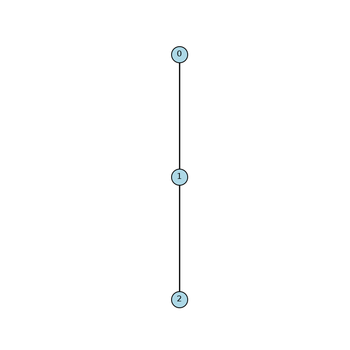

